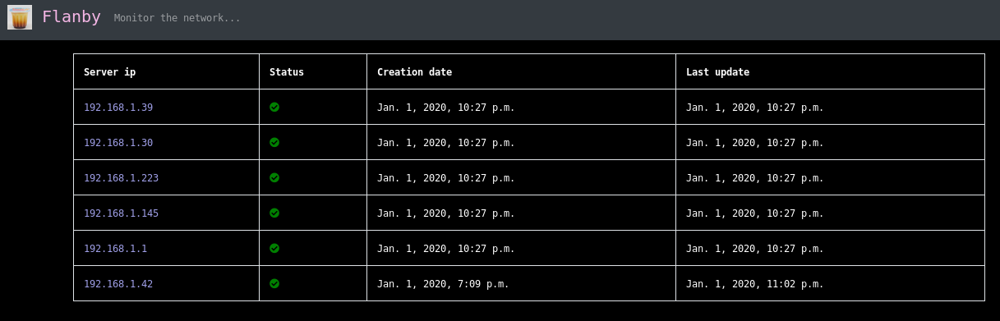
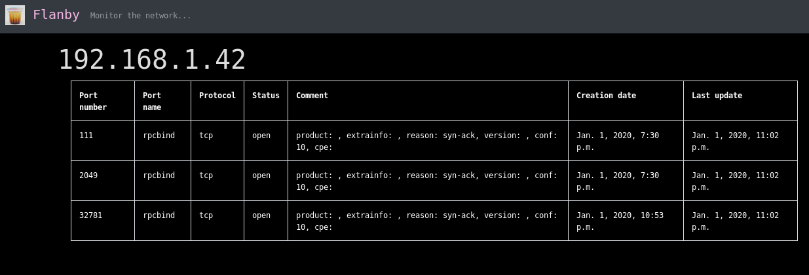

# Flanby

It's a tool for monitoring machine status, opened ports and possible vuln (next release) from the network.
It's based on nmap, python, django and sqlite
It's implemented with nmap but next release I will use masscan too.





## how to?
```
// build migrations
./manage.py makemigrations nmap_app
//create superuser
./manage.py createsuperuser --email admin@example.com --username admin
// run all migrations
./manage.py migrate
// start the server
./manage.py runserver --noreload
```

then open http://127.0.0.1:8000 in your browser

To change subnet to analyse change flanby/settings.py the FLANBY_NETWORK_SCAN_JOB variable
The task job will scan every 20 minutes the FLANBY_NETWORK_SCAN_JOB. But you can change FLANBY_TIME_SCAN_JOB value to something else

NB: the database is a sqlite db but you can modify flanby/setting.py as you want to use another db compatible with django

## for the next release...

### cve
https://github.com/CVEProject
https://vulners.com/cve/CVE-2019-14513

### nice to read
https://github.com/MyKings/python-masscan
https://github.com/robertdavidgraham/masscan/wiki/rate

### install masscan
sudo apt install masscan
if sudo permission needed to run masscan, you can check same issues from tshark, tcpdump,...
sudo setcap cap_net_raw,cap_net_admin+eip /usr/bin/masscan

https://github.com/robertdavidgraham/masscan

### scripts nmap
sudo apt install nmap
https://github.com/vulnersCom/nmap-vulners
nmap -oX - -sV --script=scripts/vulners.nse 192.168.1.1
https://nmap.org/nsedoc/categories/vuln.html

### inspiration
https://github.com/GoSecure/freshonions-torscraper
https://github.com/cloudflare/flan
https://pythonhosted.org/ifaddr/
